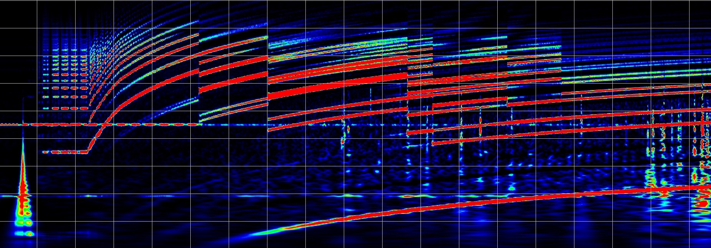

# VVVF-Radio

## Overview

A magnetic field sensor that allows you to hear the sound of a train's inverter. It has a built-in magnetic field sensor and amplifier, and has a volume control knob and line output. Because it is a line output, it can be directly connected to earphones, etc.

Requires 2 AAA batteries (sold separately). If you want to record with an IC recorder, a separate cable is required.

## Contents
・VVVF Radio body… 1

## Purchase
This product can be purchased from the following site.
Switch Science - VVVF Radio

## How to use
Connect earphones to the audio output terminal. When listening to sound, please be careful about the volume so as not to damage your ears. If your IC recorder has a line input terminal, connect an audio cable (with 3.5mm mini plugs on both ends, sold separately).

## Note
It cannot be connected to a microphone terminal or a smartphone.

The device is designed to turn on when the plug is connected to the line output terminal. Therefore, please note that leaving the cable connected will cause the battery to drain faster.

The front panel is made by a 3D printer, so the surface roughness may be noticeable.
