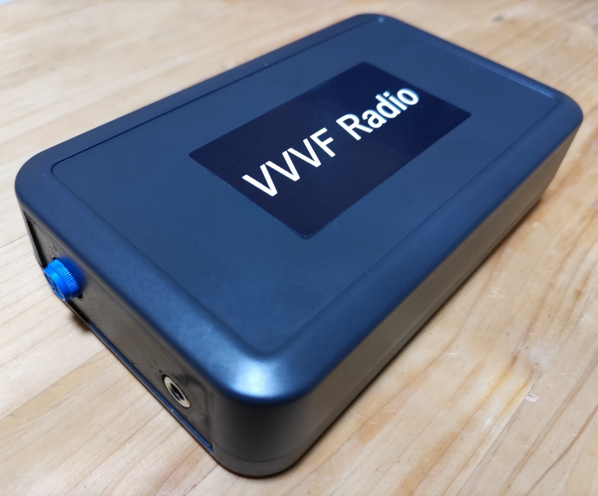

# VVVF Radio

<!-- モハラジオ -->

## 概要

電車のインバータ音を聞ける磁界センサです。
磁界センサとアンプを内蔵しており、ボリューム調節つまみとライン出力を備えています。
ライン出力のため、直接イヤホン等に接続することができます。
磁界が発生するものであれば、スピーカー、家電製品、PC、スマートフォンなどの音も聞くことができます。
ライン入力端子のあるICレコーダーに接続して録音することもできます。

単4乾電池2本（別売）が必要です。ICレコーダーで録音する場合は別途ケーブルが必要です。

## 内容品
・VVVF Radio本体 … 1

## 購入
この製品は以下のサイトから購入できます。  
[スイッチサイエンス - VVVF Radio](https://www.switch-science.com/products/9596 "VVVF Radio")

#### お問い合わせフォーム
[製品に関するお問い合わせ](https://forms.gle/Fn5E3byABXJ8P5sbA)

## 使用方法
オーディオ出力端子にイヤホンを接続します。音を聞く際は耳を傷めないよう音量に注意して下さい。
ライン入力端子のあるICレコーダーの場合は、オーディオケーブル（両端が3.5mm ミニプラグのもの　別売）を接続します。

## サンプル音
[227系東洋IGBT](https://soundcloud.com/naoto64/227igbt?si=b2d0c10c16f74043993dc020d4651cc2&utm_source=clipboard&utm_medium=text&utm_campaign=social_sharing)

## 注意
マイク端子やスマートフォンとの接続はできません。 

ライン出力端子にプラグを接続すると機器の電源がONになる仕様です。そのためケーブルをつないだままにすると電池の消耗が早くなりますのでご注意ください。 

前面パネルは3Dプリンタ製を採用しているため、表面の粗さが目立つ場合がございます。
